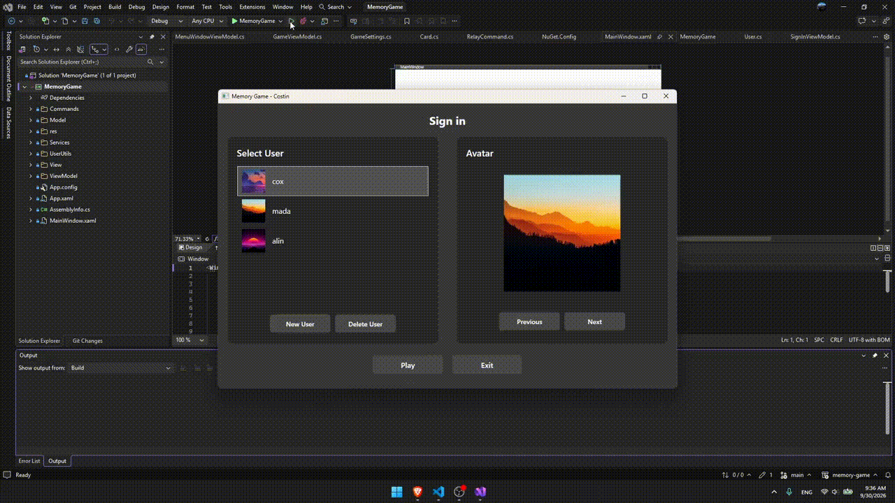
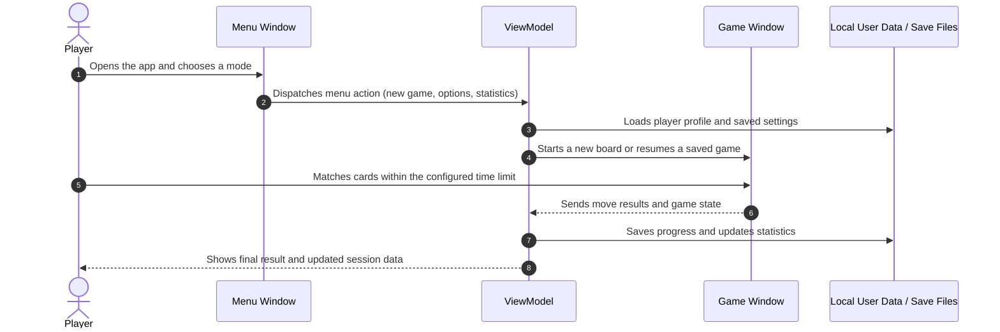

<div align="center">

# Memory Game

**A Windows desktop card-matching game that turns quick recall, strategy, and personalization into a polished WPF experience with progress tracking and configurable gameplay**

[](https://learn.microsoft.com/dotnet/desktop/wpf/)
[](https://dotnet.microsoft.com/apps/xamarin?tabs=windows)
[](https://learn.microsoft.com/dotnet/csharp/)
[](LICENSE)

</div>

---

<p align="center">
  
</p>

---

## 📌 Problem & Motivation

Classic matching games are easy to start but often feel repetitive, lack persistent progression, and do not adapt to different players or settings. Many casual desktop implementations also fail to provide meaningful stats, saved sessions, or a polished menu flow that feels intentional.

**Memory Game** addresses this by combining a clean game loop with customizable play settings, persistent user data, and a full menu experience that keeps the session engaging from start to finish.

- **Streamlined gameplay:** Players jump into themed card-pairs, choose difficulty-driven layouts, and continue without losing track of progress.
- **Personalized experience:** The app stores user information, tracks wins and played rounds, and supports a more tailored session flow.
- **Built for focus:** Time limits, board sizing, and saved state reduce friction while keeping the competitive challenge clear and rewarding.

---

## ✨ Key Features

- **⚡ Dynamic board setup:** Configurable grid rows, columns, and time constraints shape each session and create varied difficulty levels.
- **🎨 Themed interface:** A dark WPF menu and game UI provide a clean, modern desktop experience with focus on readability and interaction.
- **🔒 Persistent player data:** User profiles and saved progress are stored locally so players can resume or review their results over time.
- **📱 Desktop-first flow:** The application is designed for Windows desktop use, with dedicated menu navigation, statistics, and game actions.

---

## 🧠 Architecture & How It Works



## 🛠️ Tech Stack

| Category | Technology | Purpose / Highlights |
| --- | --- | --- |
| Frontend / Client | WPF (Windows Presentation Foundation) | Desktop UI with interactive controls, themed windows, and polished user navigation. |
| Language & Runtime | C# / .NET 8 | Core application logic, data models, commands, and gameplay behavior. |
| State / Architecture | MVVM | Separates views, view models, and reusable commands for cleaner app structure. |
| Persistence | JSON user storage + local app settings | Keeps player profiles, saved progress, and game-related state on the machine. |
| Deployment / Target | Windows desktop application | Built specifically for Windows environments with native desktop execution. |

## 🚀 Getting Started

### Prerequisites

- **Visual Studio 2022** with the following workloads installed:
  - .NET desktop development
  - Windows 10/11 SDK
- **.NET 8 SDK** (recommended for compatibility with the project)
- **Operating System:** Windows 10 or later

### 1. Installation

1. Open Visual Studio 2022.
2. Click on **Open a project or solution**.
3. Navigate to the project folder and open:
   - `MemoryGame/MemoryGame.sln`
4. Visual Studio will restore NuGet packages automatically.
5. If prompted, accept the restore/build setup and wait for the project to finish loading.

### 2. Running the Game

1. In Visual Studio, set the project as the startup project if needed.
2. Choose **Debug > Start Debugging** or press **F5**.
3. The WPF app will build and launch.

Alternatively, you can run it from the toolbar:

```text
Build > Build Solution
Debug > Start Without Debugging
```

> This project is a Windows desktop application built with WPF, so it is easiest to run from Visual Studio on a Windows machine.

## ⚙️ Configuration

The game's configurable behavior is centered around app settings and the menu-driven option flow, including:

- board size (rows and columns)
- round time limits
- saved game availability
- user-driven statistics and state persistence

These values are managed through the app's settings and data services rather than a separate external configuration file.

## 📄 License & Author

- **Author:** [Costin Ghiujan](https://github.com/coxteen)
- **License:** Released under the [MIT License](LICENSE).
